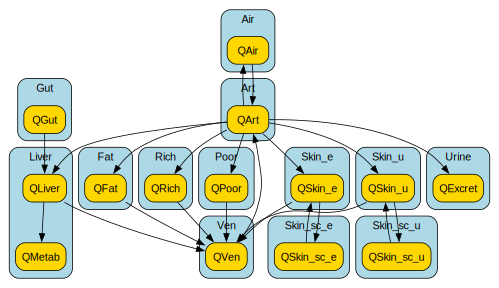

# EuroMix model to SBML

[](https://github.com/rivm-syso/euromix-to-sbml/blob/main/LICENSE)
[](https://github.com/rivm-syso/euromix-to-sbml/actions/workflows/validate.yml)

This repository contains a reimplementation of the [EuroMix PBK model](https://doi.org/10.1016/j.fct.2020.111440) in the [Antimony](https://tellurium.readthedocs.io/en/latest/antimony.html) modelling language, which is automatically converted into an annotated Systems Biology Markup Language ([SBML](https://sbml.org/)) file compliant with the [FAIR PBK standard](https://fair-pbk.github.io/fair-pbk-standard/) specification. The aim of this reimplementation is to demonstrate how interoperable PBK models can be created and shared, using the EuroMix PBK model as a practical example.

## Reimplementation in Antimony

The Antimony reimplementation of the EuroMix model is provided in [euromix.ant](model/euromix.ant). A diagram of the model compartments and species is shown below.



To translate the model to Antimony, the ODEs were manually converted to transfer equations as used in Antimony. The names of the model elements were kept consistent with the original implementation wherever possible, facilitating comparison between the original MCSim model and the Antimony re-implementation.

The 13 states of the MCSim model were mapped to chemical species in the Antimony implementation, which were arranged into 12 compartments, with the liver compartment containing two species (modelling the amount of the chemical and the amount metabolized in the liver). Internal model parameters/variables tracking the compartment volumes were mapped to the compartments themselves, which represent physical volumes in Antimony/SBML. Also the parameters and internal assignments were translated, as much as possible, in a one-to-one manner to parameters in the Antimony re-implementation. However, in order to comply with the FAIR PBK standard, all hardcoded dosing parameters of the original implementation were excluded from the model.

## SBML conversion and model annotation

Conversion to an annotated SBML file is done through a [compilation script](scripts/compile_model.py) that uses the [SBML PBK utils](https://github.com/jwkruisselbrink/sbml-pbk-utils) package. This script first converts the Antimony model implementation to SBML and then annotates this SBML file using the annotations specified in the [euromix.annotations.csv](model/euromix.annotations.csv) file. After this, it performs a validation on the generated SBML file to check for consistency and completeness of the annotations of units and terms.

The annotations CSV file that is used for annotation links the different model elements (e.g., compartments and parameters) to ontological terms and specifies the units of measure. The model and model-element annotations are specified in accordance with the [FAIR PBK standard](https://fair-pbk.github.io/fair-pbk-standard/) specification. Note that although the Antimony format also allows for specification of units and annotation of model elements directly, they are here maintained in a separate csv file. This is to keep the model implementation in the Antimony file cleaner and easier to read.

A summary report of the annotated SBML PBK model (generated by the [create_report.py](scripts/compile_model.py) script) is available [here](docs/euromix.report.md).

## Validation

The model implementation is validated by running simulations using the model for a number of scenarios. For some selected scenarios, these results are compared against the results of R/deSolve simulations on the C-implementation generated from the MCSim model implementation. The validation scenarios are defined in the `validation` folder of this repository and described [here](validation/README.md). The Python script [run_validation.py](scripts/run_validation.py) is used to run all validation scenarios.

## Open source development and archived releases

The full model code is maintained in this public repository. However, the FAIR digital resources are specific versioned releases of the annotated SBML file that are published and permanently archived on Zenodo.

## Demonstration of use

The generated annotated SBML file is considered to be the interoperable digital object that can be used/re-used by others. Notebook [get_sbml_model_info.ipynb](notebooks/get_sbml_model_info.ipynb) shows how information can be retrieved from the annotated SBML model file (e.g., units, differential equations, diagrams, semantic annotations). Notebook [run_sbml_model.ipynb](notebooks/run_sbml_model.ipynb) demonstrates how to run the SBML model.

## Running the notebooks and scripts

To run the scripts and the Jupyter notebooks, install the required python packages using the following command:

```
pip install -r requirements.txt
```
