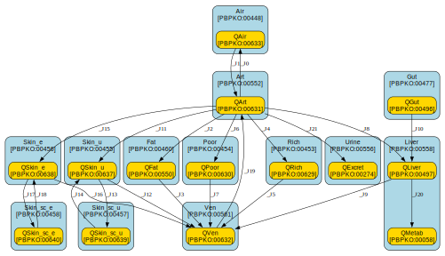

# euromix

## Creators

| first-name   | last-name     | affiliation                                                           | email   |
|:-------------|:--------------|:----------------------------------------------------------------------|:--------|
| Margriet     | Palm          | Dutch National Institute for Public Health and the Environment (RIVM) |         |
| Jordi        | Minnema       | Dutch National Institute for Public Health and the Environment (RIVM) |         |
| Johannes     | Kruisselbrink | Wageningen University & Research, Biometris                           |         |

## Notes

<notes>
  <body xmlns="http://www.w3.org/1999/xhtml">
    
Antimony/SBML reimplementation of the EuroMix PBK model of Tebby et al. 2020. 

  </body>
</notes>

## Overview

| key                          | value                                                                                  |
|:-----------------------------|:---------------------------------------------------------------------------------------|
| Modelled species/orgamism(s) | http://purl.obolibrary.org/obo/NCBITaxon_40674                                         |
| Model chemical(s)            | http://purl.obolibrary.org/obo/CHEBI_59999, http://purl.obolibrary.org/obo/CHEBI_25212 |
| Input route(s)               | 3 (inhalation, dermal, oral)                                                           |
| Time resolution              | h                                                                                      |
| Amounts unit                 | mmol                                                                                   |
| Volume unit                  | L                                                                                      |
| Number of compartments       | 13                                                                                     |
| Number of species            | 14                                                                                     |
| Number of parameters         | 41 (31 external / 10 internal)                                                         |

## Diagram

## Compartments

| id        | name                            | unit   | model qualifier                            |
|:----------|:--------------------------------|:-------|:-------------------------------------------|
| Air       | alveolar air                    | L      | http://purl.obolibrary.org/obo/PBPKO_00448 |
| Urine     | urine                           | L      | http://purl.obolibrary.org/obo/PBPKO_00556 |
| Fat       | adipose tissue                  | L      | http://purl.obolibrary.org/obo/PBPKO_00460 |
| Rich      | richly perfused tissue          | L      | http://purl.obolibrary.org/obo/PBPKO_00453 |
| Liver     | liver                           | L      | http://purl.obolibrary.org/obo/PBPKO_00558 |
| Art       | arterial blood                  | L      | http://purl.obolibrary.org/obo/PBPKO_00552 |
| Ven       | venous blood                    | L      | http://purl.obolibrary.org/obo/PBPKO_00561 |
| Skin_e    | viable epidermis exposed skin   | L      | http://purl.obolibrary.org/obo/PBPKO_00456 |
| Skin_u    | viable epidermis unexposed skin | L      | http://purl.obolibrary.org/obo/PBPKO_00455 |
| Skin_sc_e | stratum corneum exposed skin    | L      | http://purl.obolibrary.org/obo/PBPKO_00458 |
| Skin_sc_u | stratum corneum unexposed skin  | L      | http://purl.obolibrary.org/obo/PBPKO_00457 |
| Poor      | poorly perfused tissue          | L      | http://purl.obolibrary.org/obo/PBPKO_00454 |
| Gut       | gut                             | L      | http://purl.obolibrary.org/obo/PBPKO_00477 |

## Species

| id         | name                                                         | unit   | model qualifier                            |
|:-----------|:-------------------------------------------------------------|:-------|:-------------------------------------------|
| QFat       | amount of chemical in fat tissues                            | mmol   | http://purl.obolibrary.org/obo/PBPKO_00550 |
| QRich      | amount of chemical in richly tissues                         | mmol   | http://purl.obolibrary.org/obo/PBPKO_00629 |
| QPoor      | amount of chemical in poor tissues                           | mmol   | http://purl.obolibrary.org/obo/PBPKO_00630 |
| QLiver     | amount of chemical in liver                                  | mmol   | http://purl.obolibrary.org/obo/PBPKO_00497 |
| QMetab     | amount of chemical metabolized (cumulated)                   | mmol   | http://purl.obolibrary.org/obo/PBPKO_00058 |
| QGut       | amount of chemical in gut lumen                              | mmol   | http://purl.obolibrary.org/obo/PBPKO_00496 |
| QSkin_u    | amount of chemical in viable epidermis of unexposed skin     | mmol   | *not specified*                            |
| QSkin_e    | amount of chemical in viable epidermis of exposed skin       | mmol   | *not specified*                            |
| QSkin_sc_u | amount of chemical in skin stratum corneum of unexposed skin | mmol   | *not specified*                            |
| QSkin_sc_e | amount of chemical in skin stratum corneum of exposed skin   | mmol   | *not specified*                            |
| QArt       | amount of chemical in arterial blood                         | mmol   | http://purl.obolibrary.org/obo/PBPKO_00631 |
| QVen       | amount of chemical in venous blood                           | mmol   | http://purl.obolibrary.org/obo/PBPKO_00632 |
| QExcret    | amount of chemical excreted in urine (cumulated)             | mmol   | http://purl.obolibrary.org/obo/PBPKO_00274 |
| QAir       | amount of chemical in alveolar air                           | mmol   | http://purl.obolibrary.org/obo/PBPKO_00633 |

## Transfer equations

| id   | from       | to         | equation                                                                                                               |
|:-----|:-----------|:-----------|:-----------------------------------------------------------------------------------------------------------------------|
| _J0  | QArt       | QAir       | Falv * (QArt / Art) / PCAir                                                                                            |
| _J1  | QAir       | QArt       | FBlood * (QAir / Air)                                                                                                  |
| _J2  | QArt       | QFat       | FFat * (QArt / Art)                                                                                                    |
| _J3  | QFat       | QVen       | FFat * (QFat / Fat) / PCFat                                                                                            |
| _J4  | QArt       | QRich      | FRich * (QArt / Art)                                                                                                   |
| _J5  | QRich      | QVen       | FRich * (QRich / Rich) / PCRich                                                                                        |
| _J6  | QArt       | QPoor      | FPoor * (QArt / Art)                                                                                                   |
| _J7  | QPoor      | QVen       | FPoor * (QPoor / Poor) / PCPoor                                                                                        |
| _J8  | QArt       | QLiver     | FLiver * (QArt / Art)                                                                                                  |
| _J9  | QLiver     | QVen       | FLiver * (QLiver / Liver) / PCLiver                                                                                    |
| _J10 | QGut       | QLiver     | kGut * QGut                                                                                                            |
| _J11 | QArt       | QSkin_u    | FSkin_u * (QArt / Art)                                                                                                 |
| _J12 | QSkin_u    | QVen       | FSkin_u * conc(QSkin_u, Skin_u) / PCSkin                                                                               |
| _J13 | QSkin_u    | QSkin_sc_u | f_su * conc(QSkin_u, Skin_u) / PCSkin_sc                                                                               |
| _J14 | QSkin_sc_u | QSkin_u    | f_su * conc(QSkin_sc_u, Skin_sc_u)                                                                                     |
| _J15 | QArt       | QSkin_e    | FSkin_e * (QArt / Art)                                                                                                 |
| _J16 | QSkin_e    | QVen       | FSkin_e * conc(QSkin_e, Skin_e) / PCSkin                                                                               |
| _J17 | QSkin_e    | QSkin_sc_e | f_se * conc(QSkin_e, Skin_e) / PCSkin_sc                                                                               |
| _J18 | QSkin_sc_e | QSkin_e    | f_se * conc(QSkin_sc_e, Skin_sc_e)                                                                                     |
| _J19 | QVen       | QArt       | FBlood * (QVen / Ven)                                                                                                  |
| _J20 | QLiver     | QMetab     | fub * piecewise(metab_MM(Vmax, Km, PCLiver, QLiver, Liver), gt(Michaelis, 0.5), metab_MA(CLH, PCLiver, QLiver, Liver)) |
| _J21 | QArt       | QExcret    | Ke * fub * (QArt / Art)                                                                                                |

## ODEs

| species    | equation                                                                                                                                                                                                                                                                                                                                                                       |
|:-----------|:-------------------------------------------------------------------------------------------------------------------------------------------------------------------------------------------------------------------------------------------------------------------------------------------------------------------------------------------------------------------------------|
| QFat       | d[QFat]/dt = FFat * (QArt / Art)             - FFat * (QFat / Fat) / PCFat                                                                                                                                                                                                                                                                                                     |
| QRich      | d[QRich]/dt = FRich * (QArt / Art)              - FRich * (QRich / Rich) / PCRich                                                                                                                                                                                                                                                                                              |
| QPoor      | d[QPoor]/dt = FPoor * (QArt / Art)              - FPoor * (QPoor / Poor) / PCPoor                                                                                                                                                                                                                                                                                              |
| QLiver     | d[QLiver]/dt = FLiver * (QArt / Art)               - FLiver * (QLiver / Liver) / PCLiver               + kGut * QGut               - fub * piecewise(metab_MM(Vmax, Km, PCLiver, QLiver, Liver), gt(Michaelis, 0.5), metab_MA(CLH, PCLiver, QLiver, Liver))                                                                                                                    |
| QMetab     | d[QMetab]/dt = fub * piecewise(metab_MM(Vmax, Km, PCLiver, QLiver, Liver), gt(Michaelis, 0.5), metab_MA(CLH, PCLiver, QLiver, Liver))                                                                                                                                                                                                                                          |
| QGut       | d[QGut]/dt = - kGut * QGut                                                                                                                                                                                                                                                                                                                                                     |
| QSkin_u    | d[QSkin_u]/dt = FSkin_u * (QArt / Art)                - FSkin_u * conc(QSkin_u, Skin_u) / PCSkin                - f_su * conc(QSkin_u, Skin_u) / PCSkin_sc                + f_su * conc(QSkin_sc_u, Skin_sc_u)                                                                                                                                                                 |
| QSkin_e    | d[QSkin_e]/dt = FSkin_e * (QArt / Art)                - FSkin_e * conc(QSkin_e, Skin_e) / PCSkin                - f_se * conc(QSkin_e, Skin_e) / PCSkin_sc                + f_se * conc(QSkin_sc_e, Skin_sc_e)                                                                                                                                                                 |
| QSkin_sc_u | d[QSkin_sc_u]/dt = f_su * conc(QSkin_u, Skin_u) / PCSkin_sc                   - f_su * conc(QSkin_sc_u, Skin_sc_u)                                                                                                                                                                                                                                                             |
| QSkin_sc_e | d[QSkin_sc_e]/dt = f_se * conc(QSkin_e, Skin_e) / PCSkin_sc                   - f_se * conc(QSkin_sc_e, Skin_sc_e)                                                                                                                                                                                                                                                             |
| QArt       | d[QArt]/dt = - Falv * (QArt / Art) / PCAir             + FBlood * (QAir / Air)             - FFat * (QArt / Art)             - FRich * (QArt / Art)             - FPoor * (QArt / Art)             - FLiver * (QArt / Art)             - FSkin_u * (QArt / Art)             - FSkin_e * (QArt / Art)             + FBlood * (QVen / Ven)             - Ke * fub * (QArt / Art) |
| QVen       | d[QVen]/dt = FFat * (QFat / Fat) / PCFat             + FRich * (QRich / Rich) / PCRich             + FPoor * (QPoor / Poor) / PCPoor             + FLiver * (QLiver / Liver) / PCLiver             + FSkin_u * conc(QSkin_u, Skin_u) / PCSkin             + FSkin_e * conc(QSkin_e, Skin_e) / PCSkin             - FBlood * (QVen / Ven)                                       |
| QExcret    | d[QExcret]/dt = Ke * fub * (QArt / Art)                                                                                                                                                                                                                                                                                                                                        |
| QAir       | d[QAir]/dt = Falv * (QArt / Art) / PCAir             - FBlood * (QAir / Air)                                                                                                                                                                                                                                                                                                   |

## Assignment rules

| variable   | assignment                                                                                        |
|:-----------|:--------------------------------------------------------------------------------------------------|
| Fat        | BM * scVFat                                                                                       |
| Rich       | BM * scVRich                                                                                      |
| Liver      | BM * scVLiver                                                                                     |
| Art        | BM * scVBlood * scVArt                                                                            |
| Ven        | BM * scVBlood - Art                                                                               |
| Skin_e     | BSA * Height_vs * fSA_exposed                                                                     |
| Skin_u     | BSA * Height_vs * (1 - fSA_exposed)                                                               |
| Skin_sc_e  | BSA * Height_sc * fSA_exposed                                                                     |
| Skin_sc_u  | BSA * Height_sc * (1 - fSA_exposed)                                                               |
| Poor       | BM * (1 - scVFat - scVRich - scVLiver - scVBlood - 0.1) - Skin_e - Skin_u - Skin_sc_e - Skin_sc_u |
| f_su       | Kp_sc_vs * BSA * (1 - fSA_exposed)                                                                |
| f_se       | Kp_sc_vs * BSA * fSA_exposed                                                                      |
| FBlood     | scFBlood * BM                                                                                     |
| FFat       | FBlood * scFFat                                                                                   |
| FPoor      | FBlood * scFPoor                                                                                  |
| FLiver     | FBlood * scFLiver                                                                                 |
| FSkin      | FBlood * scFSkin                                                                                  |
| FRich      | FBlood - FFat - FPoor - FLiver - FSkin                                                            |
| FSkin_e    | FSkin * fSA_exposed                                                                               |
| FSkin_u    | FSkin - FSkin_e                                                                                   |

## Function definitions

| function   | definition                                                                                                          |
|:-----------|:--------------------------------------------------------------------------------------------------------------------|
| conc       | conc(q, vol) = lambda(q, vol, piecewise(q / vol, gt(vol, 0), 0))                                                    |
| metab_MM   | metab_MM(Vmax, Km, PC, q, vol) = lambda(Vmax, Km, PC, q, vol, vol * Vmax * conc(q, vol) / (PC * Km + conc(q, vol))) |
| metab_MA   | metab_MA(CLH, PC, q, vol) = lambda(CLH, PC, q, vol, CLH * conc(q, vol) / PC)                                        |

## Parameters

| id          | name                                                            | unit          | model qualifier                            |
|:------------|:----------------------------------------------------------------|:--------------|:-------------------------------------------|
| BM          | body weight                                                     | kg            | http://purl.obolibrary.org/obo/PBPKO_00008 |
| BSA         | body surface area                                               | dm^2          | http://purl.obolibrary.org/obo/PBPKO_00010 |
| scVFat      | fat volume as fraction of total body weight                     | L/kg          | http://purl.obolibrary.org/obo/PBPKO_00086 |
| scVRich     | richly perfused tissues volume as fraction of total body weight | L/kg          | http://purl.obolibrary.org/obo/PBPKO_00102 |
| scVLiver    | liver volume as fraction of total body weight                   | L/kg          | http://purl.obolibrary.org/obo/PBPKO_00078 |
| scVBlood    | blood volume as fraction of total body weight                   | L/kg          | http://purl.obolibrary.org/obo/PBPKO_00107 |
| scVArt      | arterial blood volume as fraction of total blood volume         | dimensionless | *not specified*                            |
| scFBlood    | total blood flow per unit mass                                  | L/kg/h        | http://purl.obolibrary.org/obo/PBPKO_00063 |
| scFFat      | fraction of blood flow going to adipose tissue                  | dimensionless | http://purl.obolibrary.org/obo/PBPKO_00033 |
| scFPoor     | fraction total blood flow going to poorly perfused tissue       | dimensionless | http://purl.obolibrary.org/obo/PBPKO_00047 |
| scFLiver    | fraction total blood flow going to liver                        | dimensionless | http://purl.obolibrary.org/obo/PBPKO_00025 |
| scFSkin     | fraction total blood flow going to skin                         | dimensionless | http://purl.obolibrary.org/obo/PBPKO_00037 |
| fSA_exposed | fraction of skin surface area actually exposed                  | dimensionless | http://purl.obolibrary.org/obo/PBPKO_00110 |
| Height_sc   | thickness stratum corneum                                       | dm            | *not specified*                            |
| Height_vs   | thickness viable epidermis                                      | dm            | *not specified*                            |
| Falv        | alveolar ventilation rate                                       | L/h           | http://purl.obolibrary.org/obo/PBPKO_00114 |
| PCFat       | partition coefficient fat over blood                            | dimensionless | *not specified*                            |
| PCLiver     | partition coefficient liver over blood                          | dimensionless | http://purl.obolibrary.org/obo/PBPKO_00577 |
| PCRich      | partition coefficient poorly perfused tissue over blood         | dimensionless | http://purl.obolibrary.org/obo/PBPKO_00587 |
| PCPoor      | partition coefficient richly perfused tissue over blood         | dimensionless | http://purl.obolibrary.org/obo/PBPKO_00584 |
| PCSkin_sc   | partition coefficient viable skin over stratum corneum          | dimensionless | http://purl.obolibrary.org/obo/PBPKO_00182 |
| PCSkin      | partition coefficient viable skin over blood                    | dimensionless | http://purl.obolibrary.org/obo/PBPKO_00588 |
| PCAir       | partition coefficient blood over air                            | dimensionless | http://purl.obolibrary.org/obo/PBPKO_00568 |
| kGut        | absorption rate constant gut                                    | /h            | http://purl.obolibrary.org/obo/PBPKO_00141 |
| Kp_sc_vs    | diffusion rate from stratum corneum to viable epidermis         | dm/h          | *not specified*                            |
| Km          | Michaelis-Menten constant liver                                 | mmol          | http://purl.obolibrary.org/obo/PBPKO_00214 |
| Michaelis   | flag for Michaelis-Menten or linear metabolism                  | dimensionless | *not specified*                            |
| Vmax        | maximum rate of metabolism in the liver                         | mmol/L/h      | http://purl.obolibrary.org/obo/PBPKO_00213 |
| CLH         | hepatic clearance rate                                          | L/h           | http://purl.obolibrary.org/obo/PBPKO_00234 |
| Ke          | renal excretion rate                                            | L/h           | http://purl.obolibrary.org/obo/PBPKO_00237 |
| fub         | fraction unbound in blood                                       | dimensionless | http://purl.obolibrary.org/obo/PBPKO_00622 |
| f_su        | dermal absorption flow through unexposed skin                   | L/h           | *not specified*                            |
| f_se        | dermal absorption flow through exposed skin                     | L/h           | *not specified*                            |
| FBlood      | blood flow                                                      | L/h           | http://purl.obolibrary.org/obo/PBPKO_00030 |
| FFat        | blood flow to the fat                                           | L/h           | http://purl.obolibrary.org/obo/PBPKO_00032 |
| FPoor       | blood flow to poorly perfused tissues                           | L/h           | http://purl.obolibrary.org/obo/PBPKO_00046 |
| FLiver      | blood flow to the liver                                         | L/h           | http://purl.obolibrary.org/obo/PBPKO_00024 |
| FSkin       | blood flow to the skin                                          | L/h           | http://purl.obolibrary.org/obo/PBPKO_00036 |
| FRich       | blood flow to richly perfused tissues                           | L/h           | http://purl.obolibrary.org/obo/PBPKO_00048 |
| FSkin_e     | blood flow to exposed skin                                      | L/h           | http://purl.obolibrary.org/obo/PBPKO_00563 |
| FSkin_u     | blood flow to unexposed skin                                    | L/h           | http://purl.obolibrary.org/obo/PBPKO_00562 |

